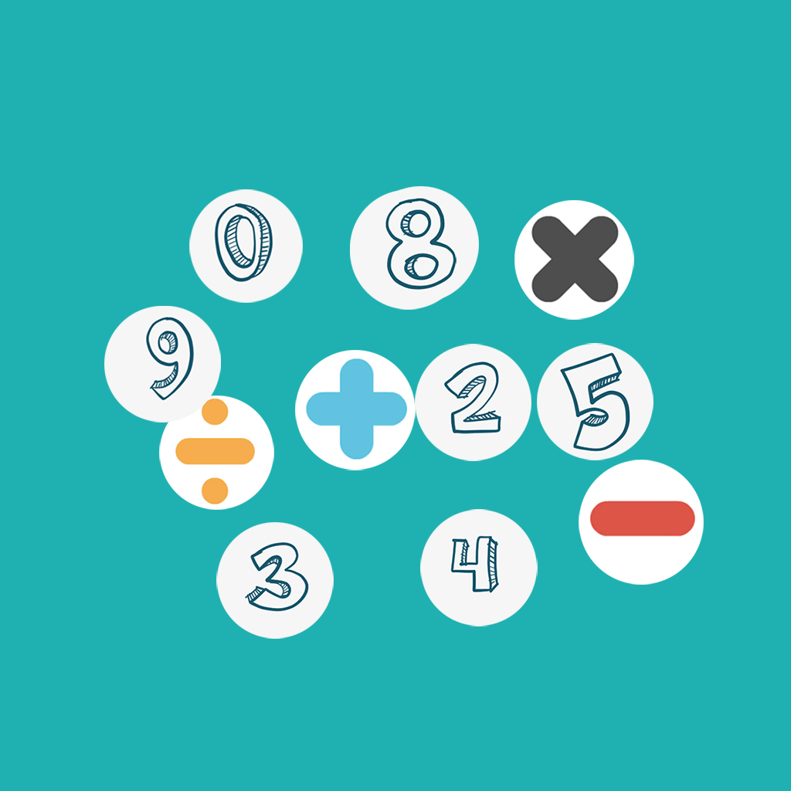

## Welcome to My Funny Count

This is an interesting counting practice tool, you can choose your favorite number and arithmetic type to challenge practice, to help you practice your arithmetic ability happily. Each count will generate a random answer and part of the arithmetic type. You need to fill in the number in the space to make the equation true. You can also add numbers of different difficulty according to your ability to make counting practice more interesting.

If you have any questions, you can either leave a message or send the questions to our email address.

We will answer them for you in the first time.

### Address: zhanghesongyuan7@126.com

Thank you!
